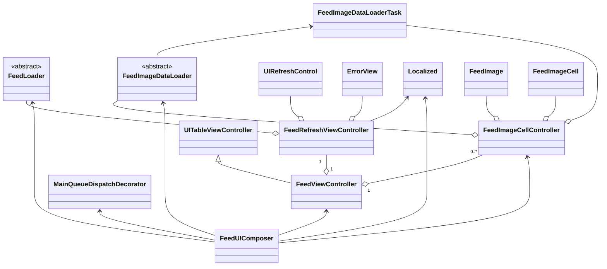
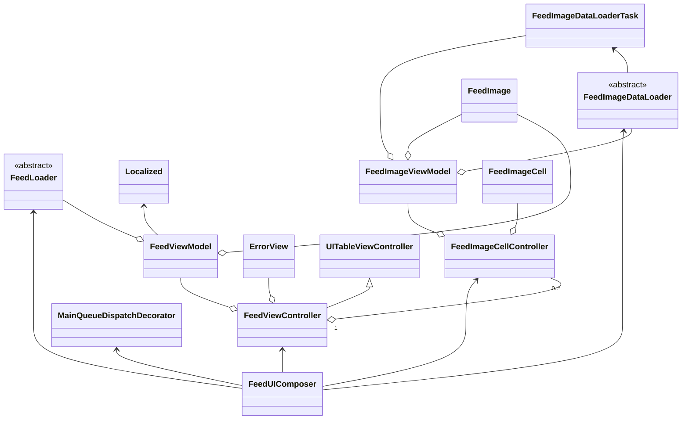
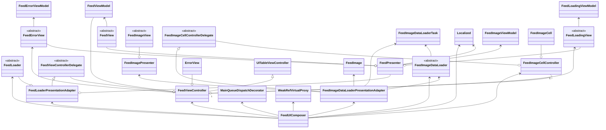

# MVC

```mermaid
classDiagram

class FeedLoader { <<abstract>> }
class FeedImageDataLoader { <<abstract>> }

FeedImageDataLoaderTask <-- FeedImageDataLoader
UIRefreshControl --o FeedRefreshViewController
ErrorView --o FeedRefreshViewController
FeedLoader --o FeedRefreshViewController
Localized <-- FeedRefreshViewController
FeedImage --o FeedImageCellController
FeedImageDataLoader --o FeedImageCellController
FeedImageDataLoaderTask --o FeedImageCellController
FeedImageCell --o FeedImageCellController
FeedRefreshViewController "1" --o "1" FeedViewController
FeedImageCellController "0..*" --o "1" FeedViewController
UITableViewController <|-- FeedViewController

Localized <-- FeedUIComposer
MainQueueDispatchDecorator <-- FeedUIComposer
FeedViewController <-- FeedUIComposer
FeedImageCellController <-- FeedUIComposer
FeedLoader <-- FeedUIComposer
FeedImageDataLoader <-- FeedUIComposer
```

# MVVM

```mermaid
classDiagram

class FeedLoader { <<abstract>> }
class FeedImageDataLoader { <<abstract>> }

FeedImageDataLoaderTask <-- FeedImageDataLoader
Localized <-- FeedViewModel
FeedLoader --o FeedViewModel
FeedImage --o FeedViewModel
FeedImageDataLoader --o FeedImageViewModel
FeedImageDataLoaderTask --o FeedImageViewModel
FeedImage --o FeedImageViewModel
FeedImageViewModel --o FeedImageCellController
FeedImageCell --o FeedImageCellController
FeedViewModel --o FeedViewController
ErrorView --o FeedViewController
FeedImageCellController "0..*" --o "1" FeedViewController
UITableViewController <|-- FeedViewController

MainQueueDispatchDecorator <-- FeedUIComposer
FeedViewController <-- FeedUIComposer
FeedImageCellController <-- FeedUIComposer
FeedLoader <-- FeedUIComposer
FeedImageDataLoader <-- FeedUIComposer
```

# MVP

```mermaid
classDiagram

class FeedLoader { <<abstract>> }
class FeedImageDataLoader { <<abstract>> }
class FeedLoadingView { <<abstract>> }
class FeedView { <<abstract>> }
class FeedErrorView { <<abstract>> }
class FeedImageView { <<abstract>> }
class FeedImageCellControllerDelegate { <<abstract>> }
class FeedViewControllerDelegate { <<abstract>> }

FeedImageDataLoaderTask <-- FeedImageDataLoader
Localized <-- FeedPresenter
FeedViewModel <-- FeedView
FeedLoadingViewModel <-- FeedLoadingView
FeedErrorViewModel <-- FeedErrorView

FeedImageViewModel <-- FeedPresenter
FeedView --o FeedPresenter
FeedLoadingView --o FeedPresenter
FeedErrorView --o FeedPresenter
FeedImageView --o FeedImagePresenter

FeedImageCellControllerDelegate --o FeedImageCellController
FeedImageCell --o FeedImageCellController
FeedViewControllerDelegate --o FeedViewController
ErrorView --o FeedViewController
FeedLoadingView <-- FeedViewController
FeedErrorView <-- FeedViewController

FeedViewModel --o FeedViewController
FeedImageCellController "0..*" --o "1" FeedViewController
UITableViewController <|-- FeedViewController

FeedLoader --o FeedLoaderPresentationAdapter
FeedPresenter --o FeedLoaderPresentationAdapter
FeedViewControllerDelegate <|-- FeedLoaderPresentationAdapter
FeedLoaderPresentationAdapter <-- FeedUIComposer
FeedImage <-- FeedImageDataLoaderPresentationAdapter
FeedImageDataLoader <-- FeedImageDataLoaderPresentationAdapter
FeedImageDataLoaderTask <-- FeedImageDataLoaderPresentationAdapter
FeedImagePresenter <-- FeedImageDataLoaderPresentationAdapter
FeedImageCellControllerDelegate <|-- FeedImageDataLoaderPresentationAdapter
FeedImageDataLoaderPresentationAdapter <-- FeedUIComposer
MainQueueDispatchDecorator <-- FeedUIComposer
FeedViewController <-- FeedUIComposer
FeedImageCellController <-- FeedUIComposer
FeedLoader <-- FeedUIComposer
FeedImageDataLoader <-- FeedUIComposer
Localized <-- FeedUIComposer
WeakRefVirtualProxy <-- FeedUIComposer
```